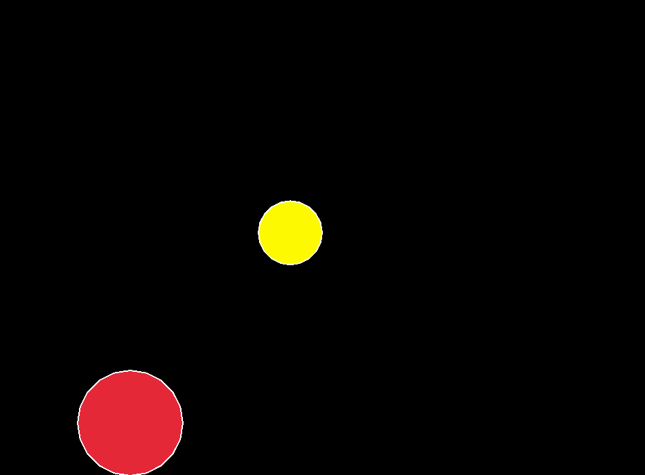

# Rust-Physics-Engine

## Description

This is a simple physics engine written in Rust and Macroquad.
I will always keep adding new features to this project.

## Table of Contents

- [Installation](#installation)
- [Usage](#usage)
- [Features](#features)
- [Contributing](#contributing)
- [License](#license)
- [Contact](#contact)
- [Acknowledgments](#acknowledgments)

## Installation

1. Clone the repo

   ```sh
   git clone https://github.com/Ekansh38/Rust-Physics-Engine.git

   ```

2. Install Dependencies

   ```sh
   cargo install macroquad
   ```

3. Run the project
   ```sh
   cd main
   cargo run
   ```

## Usage

You can use it to see cool physics simulations and learn how physics engines work.



## Features

- Rigidbody Physics
- Softbody Physics (coming soon)
- Liquid Physics (coming soon)

## Contributing

I would love for anyone to contribute to this project and make it better in anyway possible. (because I am not that good at coding)

## License

Distributed under the MIT License. See LICENSE for more information.

## Contact

Ekansh - [Twitter or X](https://x.com/mister_byte_) - [YouTube Channel](https://www.youtube.com/@mister_byte_) - goenka.ekansh@gmail.com

## Acknowledgments

- [Marcoquad Docs](https://macroquad.rs)
